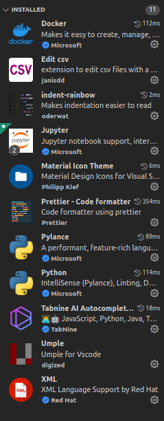

## Installation:

1. Add odoo.localhost into your host configuration
```
127.0.0.1       odoo.localhost
```

2. Build the containers
```
sudo docker-compose up -d --build
```

3. Then attach debug to vscode by pressing F5 or Run > Start debugging
<!-- 
## Liste des extensions interressantes:

 -->
4. Connect to http://odoo.localhost
5. Create a database with admin password being "educacode", then log in
and activate the module "example"

## settings.json

```json
{
	"terminal.integrated.fontFamily": "MesloLGS NF",
	"terminal.integrated.defaultProfile.osx": "zsh",
	"editor.formatOnSave": true,
	"tabnine.experimentalAutoImports": true,
	"[javascript]": {
		"editor.defaultFormatter": "esbenp.prettier-vscode",
		"editor.tabSize": 2
	},
	"prettier.tabWidth": 4,
	"prettier.useTabs": true,
	"editor.accessibilitySupport": "off",
	"[scss]": {
		"editor.defaultFormatter": "esbenp.prettier-vscode",
		"editor.tabSize": 2
	},
	"[xml]": {
		"editor.defaultFormatter": "DotJoshJohnson.xml"
	},
	"[dart]": {
		"editor.formatOnSave": true,
		"editor.formatOnType": true,
		"editor.rulers": [80],
		"editor.selectionHighlight": false,
		"editor.suggest.snippetsPreventQuickSuggestions": false,
		"editor.suggestSelection": "first",
		"editor.tabCompletion": "onlySnippets",
		"editor.wordBasedSuggestions": false
	},
	"go.toolsManagement.autoUpdate": true,
	"[jsonc]": {
		"editor.defaultFormatter": "esbenp.prettier-vscode"
	},
	"[css]": {
		"editor.defaultFormatter": "esbenp.prettier-vscode"
	},
	"[python]": {
		"editor.codeActionsOnSave": {
			"source.organizeImports": true
		}
	},

	"python.formatting.provider": "black",
	"git.autofetch": true,
	"[typescript]": {
		"editor.defaultFormatter": "vscode.typescript-language-features",
		"editor.tabSize": 2
	},
	"[typescriptreact]": {
		"editor.defaultFormatter": "vscode.typescript-language-features",
		"editor.tabSize": 2
	},
	"[javascriptreact]": {
		"editor.defaultFormatter": "vscode.typescript-language-features",
		"editor.tabSize": 2
	},
	"[json]": {
		"editor.defaultFormatter": "vscode.json-language-features"
	},
	"python.linting.pylintEnabled": true,
	"python.linting.enabled": true,
	"python.linting.pylintArgs": [
		"--load-plugins",
		"pylint_odoo",
		"--disable=E0611,C0114,C8103,C8112,W1202,W1203",
		"--disable="
	]
}
```

## Aditionnal memo

Pour dump la db du container
```
docker exec -t your-db-container pg_dumpall -c -U your_user > dump_`date +%d-%m-%Y"_"%H_%M_%S`.sql
```

Pour push le dump dans le container de la db
```
cat your_dump.sql | docker exec -i your-db-container psql -U your_user
```

Pour changer le ownership des fichier dans un container depuis le host
```
docker exec -u 0:0 your-container chown -R your-user /backup
```